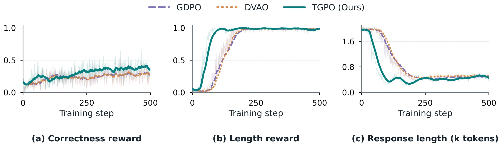
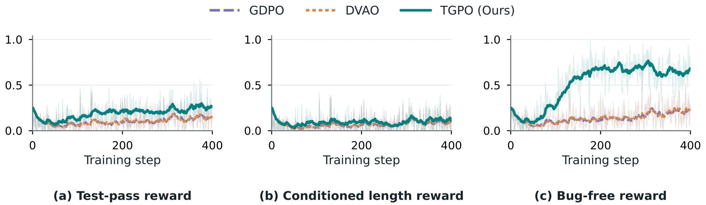
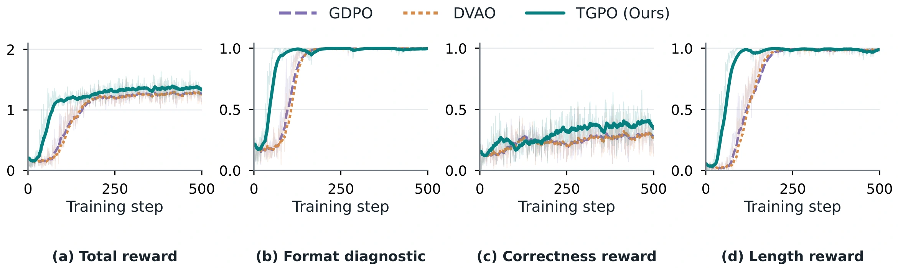
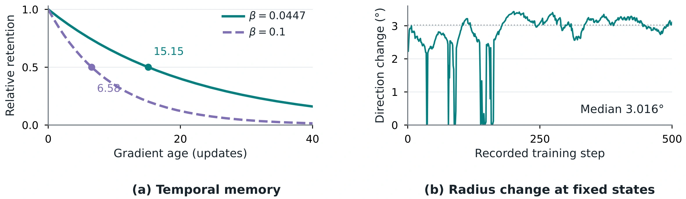
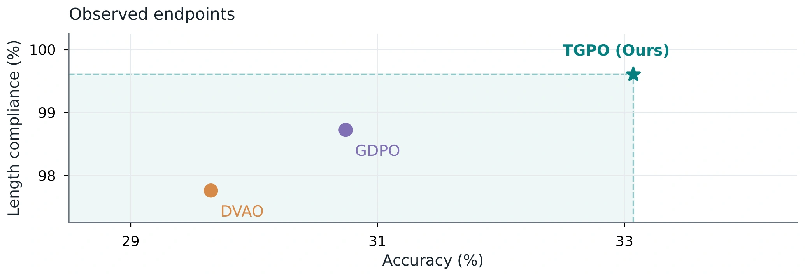
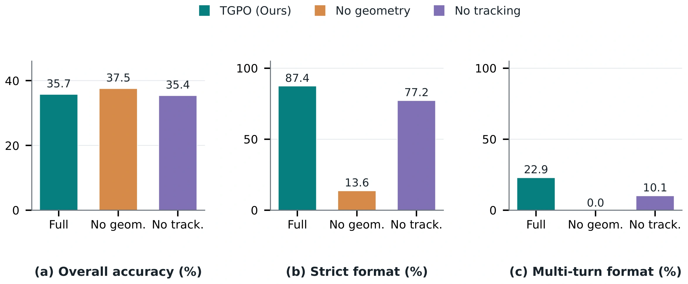

# Experimental results

[Project page](index.html) · [Reproduction instructions](../README.md)

## Mathematical reasoning

DeepSeek-R1-Distill-Qwen at 1.5B and 7B, after 500 updates. Accuracy and overlength are percentages; overlength exceeds 1,024 tokens, with generation capped at 2,048. Macro averages weight the five benchmarks equally.

### 1.5B

| Benchmark | GDPO accuracy ↑ | DVAO accuracy ↑ | TGPO (Ours) accuracy ↑ | GDPO overlength ↓ | DVAO overlength ↓ | TGPO (Ours) overlength ↓ |
| --- | ---: | ---: | ---: | ---: | ---: | ---: |
| MATH-500 | 64.30 | 64.55 | 67.75 | 0.70 | 0.80 | 0.05 |
| AIME 2024 | 9.17 | 5.00 | 3.33 | 3.33 | 5.83 | 0.83 |
| AMC 2022–2023 | 35.24 | 34.64 | 45.48 | 0.30 | 1.81 | 0.60 |
| Minerva | 19.49 | 18.66 | 19.94 | 0.28 | 0.18 | 0.09 |
| OlympiadBench | 25.52 | 25.41 | 28.85 | 1.78 | 2.59 | 0.41 |
| Macro average | 30.74 | 29.65 | 33.07 | 1.28 | 2.24 | 0.40 |

### 7B

| Benchmark | GDPO accuracy ↑ | DVAO accuracy ↑ | TGPO (Ours) accuracy ↑ | GDPO overlength ↓ | DVAO overlength ↓ | TGPO (Ours) overlength ↓ |
| --- | ---: | ---: | ---: | ---: | ---: | ---: |
| MATH-500 | 78.05 | 78.85 | 79.45 | 2.05 | 1.90 | 1.30 |
| AIME 2024 | 22.50 | 24.17 | 15.00 | 17.50 | 10.00 | 0.00 |
| AMC 2022–2023 | 57.23 | 52.41 | 50.60 | 6.02 | 4.82 | 3.01 |
| Minerva | 26.65 | 26.29 | 28.22 | 0.18 | 1.29 | 1.10 |
| OlympiadBench | 39.15 | 38.41 | 40.00 | 3.30 | 3.52 | 1.26 |
| Macro average | 44.72 | 44.02 | 42.65 | 5.81 | 4.30 | 1.33 |

## Coding reasoning

DeepSeek-R1-Distill-Qwen-1.5B; 1,014 scored questions from APPS, CodeContests, Codeforces, and TACO, with four samples per question. Rates are percentages; mean length is measured in tokens.

| Metric | GDPO | DVAO | TGPO (Ours) |
| --- | ---: | ---: | ---: |
| Pass@1 ↑ | 16.49 | 16.72 | 15.83 |
| Correct and ≤4,000 tokens ↑ | 13.54 | 13.81 | 15.73 |
| Overlength ↓ | 62.97 | 61.98 | 8.53 |
| Syntax-valid ↑ | 93.69 | 95.07 | 98.77 |
| Mean tokens ↓ | 7298.08 | 6885.39 | 2666.17 |

## Tool use

Qwen2.5-Instruct on all 4,441 BFCL-v3 questions. Rates are percentages. Overall accuracy averages the non-live, live, and multi-turn components; strict format is response-weighted.

### 1.5B

| Metric | GDPO | DVAO | TGPO (Ours) |
| --- | ---: | ---: | ---: |
| Overall accuracy ↑ | 37.46 | 44.00 | 40.09 |
| Strict format ↑ | 92.73 | 77.18 | 96.06 |
| Multi-turn format ↑ | 58.38 | 16.63 | 77.88 |

### 3B

| Metric | GDPO | DVAO | TGPO (Ours) |
| --- | ---: | ---: | ---: |
| Overall accuracy ↑ | 51.59 | 50.92 | 47.28 |
| Strict format ↑ | 97.66 | 94.18 | 99.07 |
| Multi-turn format ↑ | 75.25 | 54.75 | 89.38 |

## Mechanism ablation

Qwen2.5-Instruct-1.5B after 40 training steps; all 4,441 BFCL-v3 evaluation questions. Rates are percentages.

| Variant | Overall accuracy ↑ | Strict format ↑ | Multi-turn format ↑ |
| --- | ---: | ---: | ---: |
| Full TGPO (Ours) | 35.74 | 87.44 | 22.88 |
| No geometry | 37.52 | 13.64 | 0.00 |
| No tracking | 35.36 | 77.21 | 10.13 |

## Experimental figures

### Mathematical training

Correctness reward, length reward, and response length during 1.5B mathematical training.

### Coding training

The three optimized code rewards: test-pass fraction, syntax validity, and length compliance.

### Training dynamics

Total reward, format diagnostic, correctness reward, and length reward over 500 mathematical training steps. Faint traces show recorded values; darker traces show exponential moving averages.

### Parameter sensitivity

Tracking rate β controls directional memory; coordination radius ρ controls local geometric adjustment. The panels show analytical gradient retention and the effect of halving ρ at 500 fixed tracker states.

### Accuracy and length compliance

The 1.5B mathematical endpoints average five benchmarks equally. Both axes are oriented so that higher is better.

### Mechanism ablation

Full TGPO, no-geometry, and no-tracking variants after 40 tool-training steps, evaluated on all 4,441 BFCL-v3 questions.

## Models, datasets, and baselines

Model and dataset sources are linked in the [reproduction guide](../README.md#2-download-models-and-prepare-datasets). The baselines are [GDPO](https://github.com/NVlabs/GDPO) and [DVAO](https://arxiv.org/abs/2605.25604). Evaluation definitions and launch commands are in [Evaluate](../README.md#4-evaluate).
